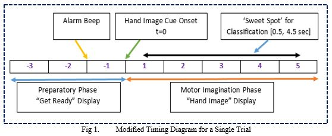
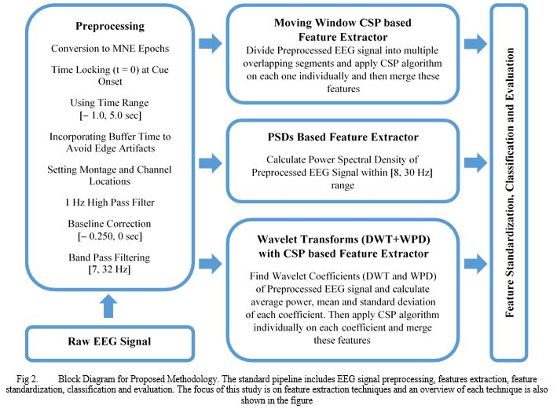
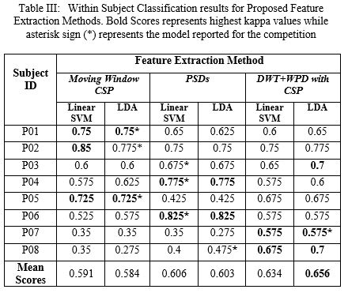
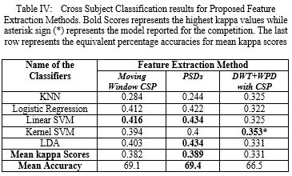

# Clinical BCI Challenge WCCI-2020

This repository contains code and data related to CBCI Challenge-2020 organized by University of Essex. 

## Problem Overview
In this competition, we are provided an EEG Dataset of 10 hemiparetic stroke patients having hand functional disability. The dataset consists of two classes which are left and right-hand grasp attempt movements. The participants in the competition are required to provide accurate and robust decoding of these movements, from the provided brain activity only. The automated decoding of these kinesthetic movements from brain signals is helpful for the development of robot-assisted therapies or interfaces for assistive technologies or rehabilitation. The decoding will be done in two ways: 1) one is within-subject classification where the training data from the same subject will be used to classify that subject’s test data, 2) another challenge will be to perform these decoding across subjects where the training data of the 8 out of 10 subjects will be used to predict the test data of the remaining 2 subjects.
 - [Dataset Link](https://github.com/5anirban9/Clinical-Brain-Computer-Interfaces-Challenge-WCCI-2020-Glasgow)
 - [Competition Website Link](https://sites.google.com/view/bci-comp-wcci/?fbclid=IwAR37WLQ_xNd5qsZvktZCT8XJerHhmVb_bU5HDu69CnO85DE3iF0fs57vQ6M)

## How to Run it?
The code is primarily written in Python 3  using Jupyter Notebooks. In order to run, it you need to have Python and Jupyter Notebook on your computer. Once you have these on your system, install the required packages, if necessary, and run all code blocks sequentially for top to bottom

#### Required Packages
- PyWavelets == 1.1.1
- mne == 0.20.3
- numpy == 1.18.1
- pandas == 1.0.3
- scikit_learn == 0.22.1
- scipy == 1.4.1 

The required packages are also listed in requirements.txt file. To install them via pip, simply go to https://pypi.org/ and search by the name of your required package and it would tell you exactly the pip command. All these packages are quite mature in terms of their development, so probably you won't face any issues even if you have other versions of the same packages installed on your system. If you want to be highly defensive then go for virtual environments.

#### For Beginners
If you are new to Python then I would highly suggest you to install [Anaconda](https://www.anaconda.com/) which would automatically manage and update different libraries to avoid conflicts. Moreover, it also comes with Jupyter Notebook pre-installed and a lot of relevant python packages like Numpy, Scipy, Matplotlib etc. [Anaconda Installation Instructions](https://docs.anaconda.com/anaconda/install/)

#### Having Issue with Previewing Files
You can view the code by opening the files at Github. Sometimes, Github have some issues in previewing Jupyter Notebooks so you may try again to 'Reload' or Just copy paste the url of the notebook and paste it in  [nbviewer](https://nbviewer.jupyter.org/)

## Abstract of the Final Report
Brain Computer Interface (BCI) promises a better future for people with neurological and physical disabilities. People with motor disabilities have long been looking towards the developments in BCI research with the hope that one day they might be able to control their limbs with their thoughts. However, the successful classification of the brain thoughts into correct intended movement is still a challenge and a lot of research has been done in this regard. This work is intended for one such cause i.e. Clinical BCI Challenge-WCCI 2020 that has provided an EEG dataset of 10 hemiparetic stroke patients having hand functional disabilities who were trying to imagine left or right hand grasp movement. The aim is to successfully classify these signals as one of the intended movements and this could help in the development of robot assisted therapies or as an interface for assistive devices. In this study, we have focused on three different feature extraction methods based on time-frequency analysis and common spatial pattern (CSP) techniques and compared the within subject and cross subject performance based on the kappa scores. These methods include moving window CSP based feature extractor, PSD based feature extractor, and Wavelet Transform (DWT+WPD) with CSP based feature extractor. We empirically found that, for within subject classification, wavelet transform with CSP based method is the most accurate one with a mean kappa score of 0.668 (82.8% accuracy) while for cross subject classification, PSD based method gave highest kappa value of 0.389 (69.4% accuracy). Moreover, to report results for the competition, we have also used additional information of balanced trials to our advantage and selected the model that has the highest kappa score without a high bias toward any of the classes. 

## Single Trial Timing Details

## Block Diagram

## Results

#### Within Subject Classification Results

#### Cross Subject Classification Results

## Contacting the Author
If you are facing some issues in running the code then open a [Github Issue](https://github.com/SulemanRasheed/CBCI-Competition-2020/issues). Otherwise, if you need more info about the project or just want to discuss some ideas related to this project then feel free to contact me at: 
Email: SulemanRasheedEngr@gmail.com
