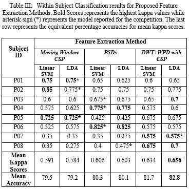

# Clinical BCI Challenge WCCI-2020

This repository contains code and data related to CBCI Challenge-2020 organized by University of Essex. 

## Problem Overview
In this competition, we are provided an EEG Dataset of 10 hemiparetic stroke patients having hand functional disability. The dataset consists of two classes which are left and right-hand grasp attempt movements. The participants in the competition are required to provide accurate and robust decoding of these movements, from the provided brain activity only. The automated decoding of these kinesthetic movements from brain signals is helpful for the development of robot-assisted therapies or interfaces for assistive technologies or rehabilitation. The decoding will be done in two ways: 1) one is within-subject classification where the training data from the same subject will be used to classify that subject’s test data, 2) another challenge will be to perform these decoding across subjects where the training data of the 8 out of 10 subjects will be used to predict the test data of the remaining 2 subjects.
 - [Dataset Link](https://github.com/5anirban9/Clinical-Brain-Computer-Interfaces-Challenge-WCCI-2020-Glasgow)
 - [Competition Website Link](https://sites.google.com/view/bci-comp-wcci/?fbclid=IwAR37WLQ_xNd5qsZvktZCT8XJerHhmVb_bU5HDu69CnO85DE3iF0fs57vQ6M)

## How to Run it?
The code is primarily written in Python in the form of Jupyter Notebook. In order to run, it you should have installed Python on your computer. The required packages are listed in requirements.txt file.  
You can view the code by opening the files at Github. Sometimes, Github have some issues in previewing Jupyter Notebooks so you may try again to 'Reload' or Just copy paste the url of the notebook and paste it in  [nbviewer](https://nbviewer.jupyter.org/)

## Abstract of the Final Report
Brain Computer Interface (BCI) promises a better future for people with neurological and physical disabilities. People with motor disability have been looking towards the developments in BCI research with the hope that one day they might help them control their limbs with their thoughts. However, the successful classification of the brain thoughts into correct intended movement is still a challenge. A lot of work has been done in this regard and still people are trying hard to push the boundaries. This work is intended for such a cause i.e. Clinical BCI Challenge-WCCI 2020 that has provided a EEG dataset of 10 hemiparetic stroke patients having hand functional disabilities who are trying to imagine left or right hand grasp movement. The aim is to successfully classify these signals as one of the intended movements and this could help in the development of robot assisted therapies or as an interface for assistive devices. In this study, we have focused on three different feature extraction methods that combine time-frequency analysis and common spatial pattern techniques and compared their performance based on the kappa scores. These methods include moving window CSP based feature extractor, PSD based feature extractor and Wavelet Transform (DW+/WPD) with CSP based feature extractors to classify both within subject and cross subject hand movements. The results have shown that for within subject classification, wavelet transform with CSP based method is the most accurate one with mean kappa score of 0.668 while for cross subject classification we found PSDs based method to be of highest kappa value 0.389. Moreover, to report results for the competition, we have also used additional information of balanced trials to our advantage and we selected the model that has highest kappa score without a high bias toward any of the classes.

## Block Diagram

## Results

#### Within Subject Classification Results

#### Cross Subject Classification Results

